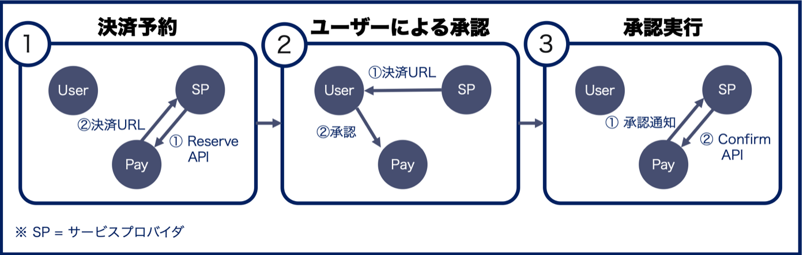
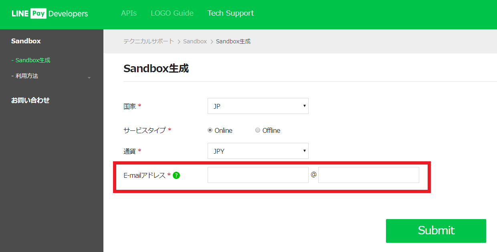
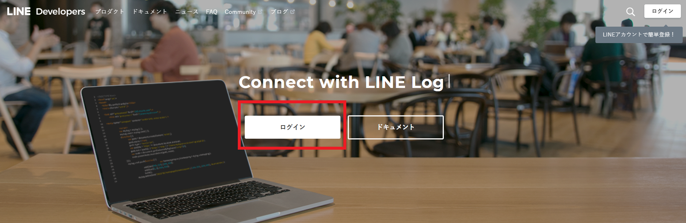
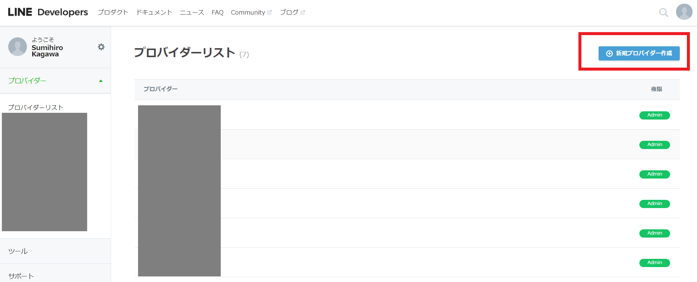

# LINE Pay ハンズオン資料 [Version. 2019.10.03]

## 1-1. LINE Pay とは

LINE Payは、LINEのユーザーがLINE Pay加盟店のサイトで利用できる決済システムです。
ユーザーがLINE Payを使って支払いをするには、決済を行うサイトがLINE Pay加盟店である必要があります。

### LINE Pay の加盟店申請

#### 個人でも加盟店申請できる

LINE Pay の加盟店になるには法人でなくとも大丈夫です。個人で加盟店申請するには、個人事業主として開業届を出して青色申告をしてあればOKです。
LINE Pay 公式の「よくある質問」にも、個人事業主でも加入できると書いてあります。

[個人事業主も加入できますか？：よくある質問＠LINE Pay](https://pay.line.me/jp/intro/faq?locale=ja_JP&sequences=14)

**その他、詳しい申請方法は [LINE API HANDBOOK](https://miso-develop.booth.pm/items/1573526) の第11章に書いてありますので、ぜひ読んでください！**

## LINE Pay API を使った処理の流れ

3つの登場人物が存在します。

一つ目は サービスプロバイダー です。これは有償で商品またはサービスを提供する事業主（おそらくあなた）で、実質的に何らかのアプリとなります。

二つ目は その商品またはサービスを購入する ユーザー です。

そして三つ目は LINE Payです。サービスプロバイダーはLINE PayのAPIに、ユーザーはLINE Payのアプリにアクセスして下記の流れで決済をおこなうことになります。

### 2-1. 決済の流れ

#### a) 決済予約

LINE Pay 決済を行う前に、サービスプロバイダーの状態が正常であるかを判断し、決済のための情報を予約します。
決済予約が成功したら、決済完了/払い戻しするまで使用する「取引番号（transactionId）」と、決済を実行する「決済URL（paymentUrl）」が発行されます。

**デフォルトではオーソリと売り上げ処理が一度に処理されますが、オーソリのみ行うことも可能です**

#### b) ユーザーによる承認

画面が決済URLへ遷移後、LINE Pay の画面でユーザーが決済内容を確認して決済を承認します。

#### c) 承認実行
サービスプロバイダーが決済を最終的に完了させるための API です。サービスプロバイダーで決済 confirm API を呼び出すことによって、実際の決済が完了します。

**決済予約時にオーソリのみ行うこととした場合、confirm API 実行時はオーソリ状態になるため、「Capture API」を実行して決済完了とする必要があります。**

## LINE Pay Sandboxの申請と設定

実際に決済するには加盟店登録が必要ですが、開発して動作を確認するフェーズであればSandbox が利用できます。こちらは下記のURLから申請すると、Sandbox 用のLINE Pay API アカウントが払い出されますので、誰でもすぐに利用できます。

### 3-1. LINE Pay Sandboxの申請

[こちら](https://pay.line.me/jp/developers/techsupport/sandbox/creation?locale=ja_JP) からSandbox環境の利用申請ができます。
メールアドレスを入力して「Submit」ボタンを押下するとアカウント情報が払い出されます。

### 3-2. キー情報の確認

アカウントが払い出されたら[LINE Pay コンソール](https://pay.line.me/login/) の決済連動管理 > 連動キー管理からChannel ID とChannel Secret Key を確認します。これらの値はLINE Pay のAPI コールに必要になります。
メモしておいてください。

### 3-3. 技術ドキュメント

ちょっと見つけにくいですが、[ここ](https://pay.line.me/jp/developers/documentation/download/tech?locale=ja_JP) にあります。

[LINE Pay技術連動ガイド](https://pay.line.me/file/guidebook/technicallinking/LINE_Pay_Integration_Guide_for_Merchant-v1.1.2-JP.pdf) に詳細なAPI 情報が載っていますので、実装の際にはこちらを読んでください。

## チャネルの作成

### 4-1. LINE Developers にログイン

[LINE Developers](https://developers.line.biz/ja/) にアクセスしてログイン

### 4-2. プロバイダーを選択

任意のプロバイダーを選択

#### プロバイダー未作成の人は画面右上の「新規プロバイダー作成」ボタンを押下して新規作成してください。

*任意の「プロバイダー名」を入力して作成*

## 実装と実行

### 5-1. 環境変数の設定（.env ファイル）

git clone からの各種キー設定変更で ngrok 使って実行！

