# LINE Pay ハンズオン資料 [Version. 2019.10.03]

## LINE Pay とは

LINE Payは、LINEのユーザーがLINE Pay加盟店のサイトで利用できる決済システムです。
ユーザーがLINE Payを使って支払いをするには、決済を行うサイトがLINE Pay加盟店である必要があります。

### 1-1. LINE Pay の加盟店申請

#### 個人でも加盟店申請できる

LINE Pay の加盟店になるには法人でなくとも大丈夫です。個人で加盟店申請するには、個人事業主として開業届を出して青色申告をしてあればOKです。
LINE Pay 公式の「よくある質問」にも、個人事業主でも加入できると書いてあります。

[個人事業主も加入できますか？：よくある質問＠LINE Pay](https://pay.line.me/jp/intro/faq?locale=ja_JP&sequences=14)

**その他、詳しい申請方法は [LINE API HANDBOOK](https://miso-develop.booth.pm/items/1573526) の第11章に書いてありますので、ぜひ読んでください！**


## LINE Pay API を使った処理の流れ

3つの登場人物が存在します。

一つ目は サービスプロバイダー です。これは有償で商品またはサービスを提供する事業主（おそらくあなた）で、実質的に何らかのアプリとなります。

二つ目は その商品またはサービスを購入する ユーザー です。

そして三つ目は LINE Payです。サービスプロバイダーはLINE PayのAPIに、ユーザーはLINE Payのアプリにアクセスして下記の流れで決済をおこなうことになります。

### 2-1. 決済の流れ


#### a) 決済予約

LINE Pay 決済を行う前に、サービスプロバイダーの状態が正常であるかを判断し、決済のための情報を予約します。
決済予約が成功したら、決済完了/払い戻しするまで使用する「取引番号（transactionId）」と、決済を実行する「決済URL（paymentUrl）」が発行されます。

**デフォルトではオーソリと売り上げ処理が一度に処理されますが、オーソリのみ行うことも可能です**

#### b) ユーザーによる承認

画面が決済URLへ遷移後、LINE Pay の画面でユーザーが決済内容を確認して決済を承認します。

#### c) 承認実行
サービスプロバイダーが決済を最終的に完了させるための API です。サービスプロバイダーで決済 confirm API を呼び出すことによって、実際の決済が完了します。


**決済予約時にオーソリのみ行うこととした場合、confirm API 実行時はオーソリ状態になるため、「Capture API」を実行して決済完了とする必要があります。**


## LINE Pay Sandboxの申請と設定

実際に決済するには加盟店登録が必要ですが、開発して動作を確認するフェーズであればSandbox が利用できます。こちらは下記のURLから申請すると、Sandbox 用のLINE Pay API アカウントが払い出されますので、誰でもすぐに利用できます。

### 3-1. LINE Pay Sandboxの申請


[こちら](https://pay.line.me/jp/developers/techsupport/sandbox/creation?locale=ja_JP) からSandbox環境の利用申請ができます。
メールアドレスを入力して「Submit」ボタンを押下するとアカウント情報が払い出されます。

### 3-2. キー情報の確認

アカウントが払い出されたら[LINE Pay コンソール](https://pay.line.me/login/) の決済連動管理 > 連動キー管理からChannel ID とChannel Secret Key を確認します。これらの値はLINE Pay のAPI コールに必要になります。
メモしておいてください。


### 3-3. 技術ドキュメント

ちょっと見つけにくいですが、[ここ](https://pay.line.me/jp/developers/documentation/download/tech?locale=ja_JP) にあります。

[LINE Pay技術連動ガイド](https://pay.line.me/file/guidebook/technicallinking/LINE_Pay_Integration_Guide_for_Merchant-v1.1.2-JP.pdf) に詳細なAPI 情報が載っていますので、実装の際にはこちらを読んでください。


## ngrok の実行

### 4-1. ngrok を実行する

新規にターミナルまたはコマンドプロンプト（Powershell）を起動して、ngrok を実行する

```bash
$ ngrok http 5000
```

ngrok が起動したら「Forwarding」のURL（HTTPSの方）をメモしておく

```bash
ngrok by @inconshreveable                                                                                                                                                                                                                    (Ctrl+C to quit)

Session Status                online
Session Expires               7 hours, 28 minutes
Update                        update available (version 2.3.34, Ctrl-U to update)
Version                       2.3.18
Region                        United States (us)
Web Interface                 http://127.0.0.1:4040
Forwarding                    http://xxxxxx.ngrok.io -> http://localhost:5000
Forwarding                    https://xxxxxx.ngrok.io -> http://localhost:5000
```

## チャネルの作成

### 5-1. LINE Developers にログイン

[LINE Developers](https://developers.line.biz/ja/) にアクセスしてログイン


### 5-2. プロバイダーを選択

任意のプロバイダーを選択


#### プロバイダー未作成の人は画面右上の「新規プロバイダー作成」ボタンを押下して新規作成してください。

*任意の「プロバイダー名」を入力して作成*

### 5-3. チャネルを新規作成

#### Botのチャネルを作成
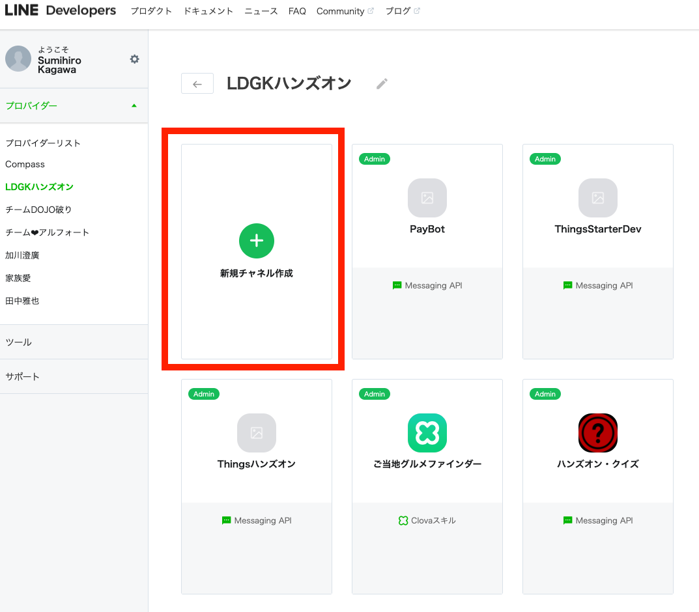

#### 「Messaging API」 を選択
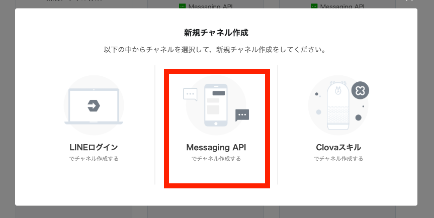

#### チャネル情報を入力

チャネル情報を入力して、「入力内容を確認する」ボタンを押下する。

##### チャネル情報の入力例

- アプリ名
    - HandsOnPayBot
- アプリ説明
    - LINE  Pay ハンズオン
- 大業種
    - 個人
- 小業種
    - 個人（その他）
- メールアドレス
    - （ご自分のメールアドレス）

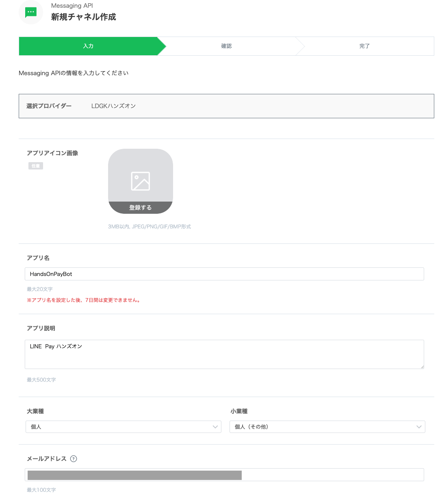

#### 各種規約に同意してチャネルを作成する

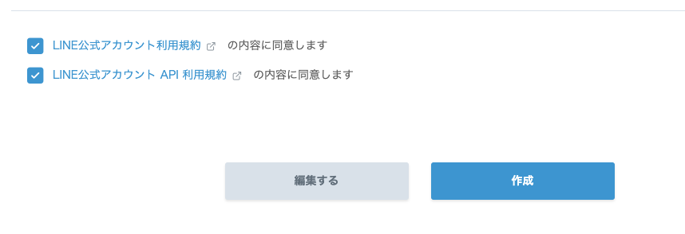


## チャネルの設定

### 6-1. チャネル基本情報画面を開く

作成したチャネルを選択してチャネル基本情報画面を開く

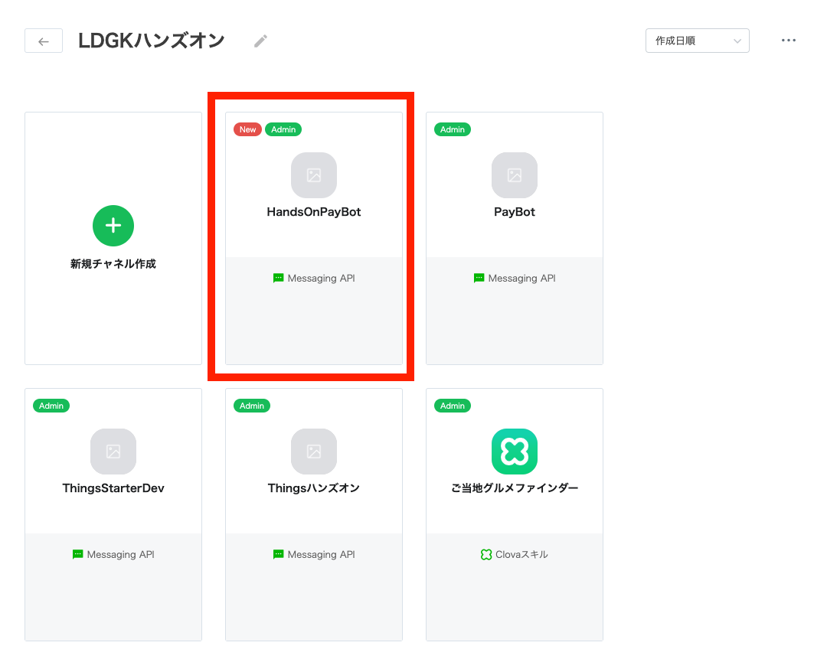

### 6-2. Channel Secret をメモしておく

チャネル基本情報画面に表示されているChannel Secret をメモしておく

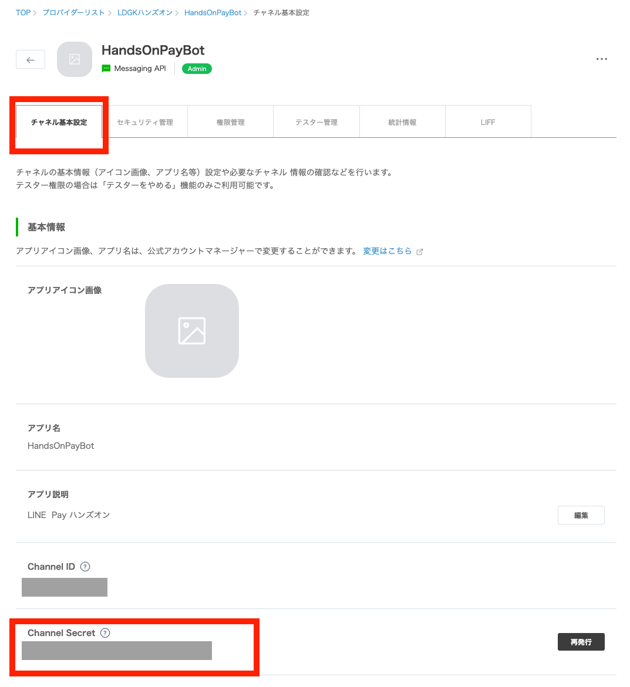

### 6-3. アクセストークン を発行してメモしておく

アクセストークンの「再発行」ボタンを押下して発行し、メモしておく

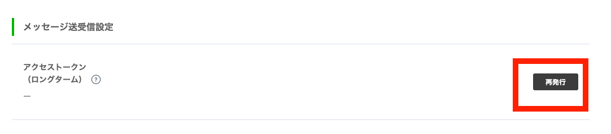

### 6-4. Webhook 設定

Webhook送信 を「利用する」に設定して更新ボタンを押下する

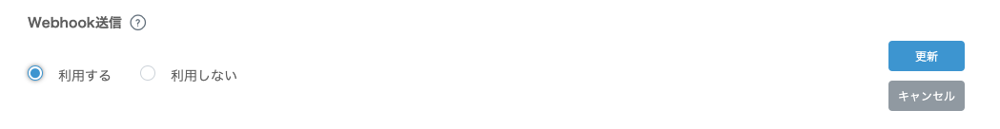

### 6-5. Webhook URL設定

Webhook RUL に4-1 でメモしたngrok のURL + /webhook を入力して更新ボタンを押下する

* "https://" は不要です

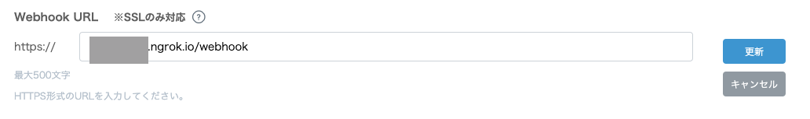

### 6-6. 自動応答メッセージ設定

自動応答メッセージ の画面右側にある「設定はこちら」リンクを押下して、公式アカウントマネージャー画面を開く

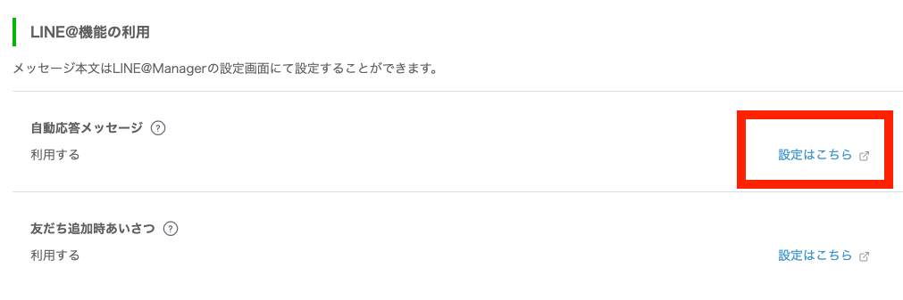

応答設定の詳細設定

- 応答メッセージ
    - オフ
- Webhook
    - オン

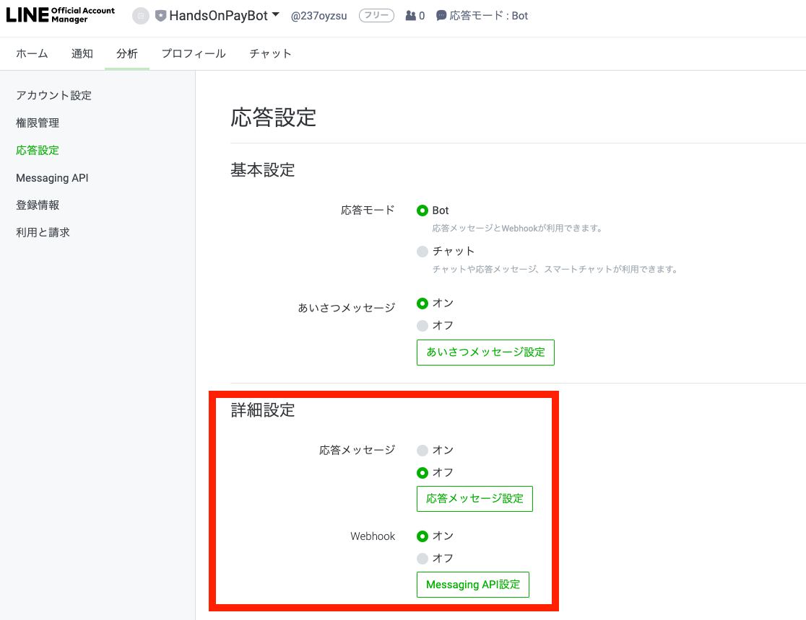

### 6-7. 作成したBotのチャネルを友だち登録する

LINEアプリへのQRコードをLINEアプリで読み込んで友だち登録する

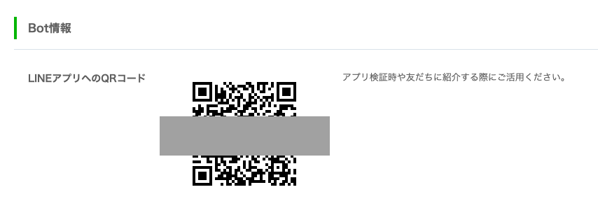


## 実装と実行

### 7-1. git clone

ハンズオン用に適当なディレクトリを作成して、そこへソースコードをgit clone する

クローンできたら、ダウンロードしたディレクトリをVisualStucioCode で開いておく

#### Mac

```bash
$ mkdir ~/ldgk-line-pay-hands-on && cd ~/ldgk-line-pay-hands-on
$ git clone https://github.com/sumihiro3/hands-on-line-pay.git
$ cd hands-on-line-pay
```

#### Windows

```bat
> mkdir c:¥tmp¥ldgk-line-pay-hands-on
> cd c:¥ldgk-line-pay-hands-on
> git clone https://github.com/sumihiro3/hands-on-line-pay.git
> cd hands-on-line-pay
```

#### git clone 出来ない場合はリポジトリ内容をZIPファイルでダウンロード

git clone 出来ない場合は、[リポジトリのページ](https://github.com/sumihiro3/hands-on-line-pay.git)にアクセスして、ページ右側の「Clone or download」ボタンを押下、「Download ZIP」ボタンを押下してリポジトリのZIPファイルをダウンロードし、適当なディレクトリに展開してください。

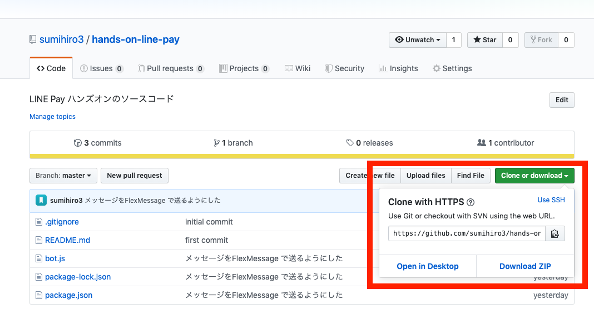

### 7-2. プログラムに必要なモジュールをインストール

```bash
$ npm install
```

### 7-3. メモしておいた設定を、設定ファイルに記入する

.env_sample ファイルを.env にリネームし、.env ファイルに設定を記入する

```
LINE_PAY_CHANNEL_ID=XXXXXXX
LINE_PAY_CHANNEL_SECRET=XXXXXXXXXXXXXXXXXXXXXXXXXXXX
LINE_PAY_CONFIRM_URL=https://XXXXXXXX.ngrok.io/pay/confirm
LINE_BOT_CHANNEL_SECRET=XXXXXXXXXXXXXXXXXXXXXXXXXXXXX
LINE_BOT_ACCESS_TOKEN=XXXXXXXXXXXXXXXXXXXXXXXXXXXXXXXXXXXXXXXXXXXXXXXXXXXXXXXXXXXXXXXX
```

- LINE_PAY_CHANNEL_ID
    - LINE Pay のChannel ID
- LINE_PAY_CHANNEL_SECRET
    - LINE Pay のChannel Secret
- LINE_PAY_CONFIRM_URL
    - https://XXXXXXXX.ngrok.io/pay/confirm
- LINE_BOT_CHANNEL_SECRET
    - LINE Bot のChannel Secret
- LINE_BOT_ACCESS_TOKEN
    - LINE Bot のアクセストークン

### 7-4. プログラムを起動

```bash
$ node bot.js
```


## BotでLINE Pay を試してみよう

### 8-1. Bot のトーク画面で「チョコレート」と送る

LINE アプリで作成したBot のトーク画面を開く


テキストで「チョコレート」とメッセージを送る


サーバーサイドではLINE Pay の決済予約が実行され、取引番号（transactionId）」と、決済を実行する「決済URL（paymentUrl）」が発行されます

### 8-2. LINE Pay 決済を体験

「LINE Pay で決済」ボタンを押下して決済画面へ遷移する
このボタンを押下するとLINE Pay の決済予約で返された「決済URL（paymentUrl）」のページ（LINE Pay の決済画面）にアクセスします


「PAY NOW」ボタンを押下して決済を実行する

ここがLINE Pay での「ユーザーによる承認」にあたります


決済が完了すると、サーバーサイドにWebhook が送信されます
承認実行（confirm API）を行うと決済が完了し、トーク画面へメッセージを送信します（Push API）


