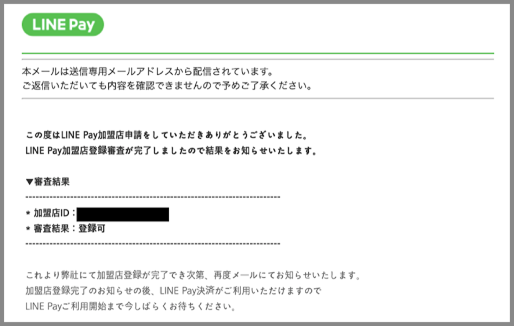
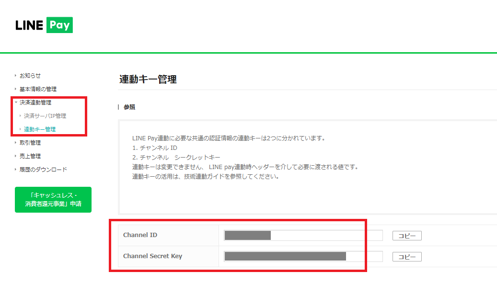

# LINE Pay ハンズオン資料

## 加盟店審査

申請書類の不備などが二度ありましたが、約2週間で審査完了しました。審査がスムーズなのも時間がない個人としてはうれしいところです。

審査が完了すると、下のようなメールが届きます。

## LINE Pay Sandboxの申請と設定

実際に決済するには加盟店登録が必要ですが、開発して動作を確認するフェーズであればSandbox が利用できます。こちらは下記のURLから申請すると、Sandbox 用のLINE Pay API アカウントが払い出されますので、誰でもすぐに利用できます。

### LINE Pay Sandboxの申請
    - @<href>{https://pay.line.me/jp/developers/techsupport/sandbox/creation?locale=ja_JP}

アカウントが払い出されたらLINE Pay コンソールの決済連動管理 > 連動キー管理からChannel ID とChannel Secret Key を確認します。これらの値はLINE Pay のAPI コールに必要になります。

